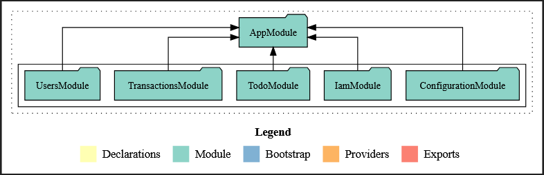

<p align="center">
  <a href="http://nestjs.com/" target="blank"></a>
</p>

### <a href="https://roadmap.sh/projects/todo-list-api" target="_blank"> <b>Project URL</b></a>

[circleci-image]: https://img.shields.io/circleci/build/github/nestjs/nest/master?token=abc123def456
[circleci-url]: https://circleci.com/gh/nestjs/nest

  <p align="center">A progressive <a href="http://nodejs.org" target="_blank">Node.js</a> framework for building efficient and scalable server-side applications.</p>
    <p align="center">
<a href="https://www.npmjs.com/~nestjscore" target="_blank"></a>
<a href="https://www.npmjs.com/~nestjscore" target="_blank"></a>
<a href="https://www.npmjs.com/~nestjscore" target="_blank"></a>
<a href="https://circleci.com/gh/nestjs/nest" target="_blank"></a>
<a href="https://coveralls.io/github/nestjs/nest?branch=master" target="_blank"></a>
<a href="https://discord.gg/G7Qnnhy" target="_blank"></a>
<a href="https://opencollective.com/nest#backer" target="_blank"></a>
<a href="https://opencollective.com/nest#sponsor" target="_blank"></a>
  <a href="https://paypal.me/kamilmysliwiec" target="_blank"></a>
    <a href="https://opencollective.com/nest#sponsor"  target="_blank"></a>
  <a href="https://twitter.com/nestframework" target="_blank"></a>
</p>
  <!--[](https://opencollective.com/nest#backer)
  [](https://opencollective.com/nest#sponsor)-->

## Description Todo List API


In this project we are required to develop a RESTful API to allow users to manage their to-do list. 
The backend projects will require you to implement:
1. Implement user authentication as well.
2. Implement filtering and sorting for the to-do list
3. Implement unit tests for the API
4. Implement rate limiting and throttling for the API
5. Implement refresh token mechanism for the authentication


###  Goals
The skills used from this project include:

1. User authentication
2. Schema design and Databases
3. RESTful API design
4. CRUD operations
5. Error handling
6. Security

###  Requirements
We are required to develop a RESTful API with following endpoints

1. User registration to create a new user
2. Login endpoint to authenticate the user and generate a token
3. CRUD operations for managing the to-do list
4. Implement user authentication to allow only authorized users to access the to-do list
5. Implement error handling and security measures
6. Use a database to store the user and to-do list data (you can use any database of your choice)
7. Implement proper data validation
8. Implement pagination and filtering for the to-do list

###  Solution overview




## Installation

```bash
$ yarn install
```

## Running the app

```bash
# development
$ yarn run start

# watch mode
$ yarn run start:dev

# production mode
$ yarn run start:prod
```

## Test

```bash
# unit tests
$ yarn run test

# e2e tests
$ yarn run test:e2e

# test coverage
$ yarn run test:cov
```

## Support

Nest is an MIT-licensed open source project. It can grow thanks to the sponsors and support by the amazing backers. If you'd like to join them, please [read more here](https://docs.nestjs.com/support).

## Stay in touch

- Author - [Jordach Makaya](https://kamilmysliwiec.com)
- Linkedin - [@jordachmakaya](https://www.linkedin.com/in/jordachmakaya/)

## License

Nest is [MIT licensed](LICENSE).
